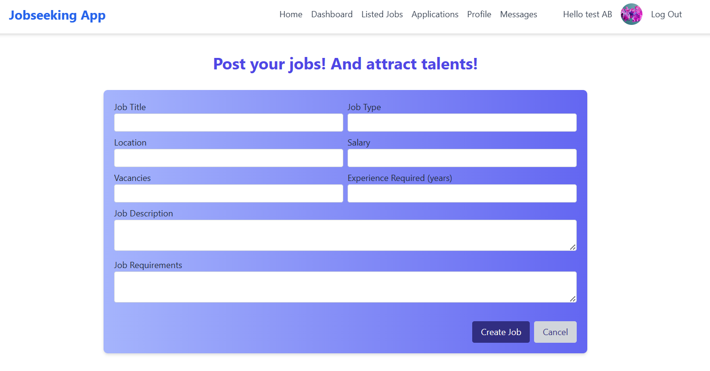

# Job-Seeking Application

A **full-stack MERN web application** designed to connect job seekers with companies, providing tailored experiences for users. This app streamlines the connection between job seekers and employers, allowing users to search and apply for jobs, companies to post job listings, and admins to manage the platform.

**Live Demo:** [https://jseekingappp.netlify.app](https://jseekingappp.netlify.app)

---

## Table of Contents

- [Features](#features)  
- [User Roles](#user-roles)  
- [Authentication](#jwt-authentication)  
- [Progressive Web App (PWA)](#progressive-web-app-pwa)  
- [File Uploads](#file-uploads)  
- [Contact Form / Messaging](#contact-form--messaging)  
- [Frontend & Design](#frontend--design)  
- [Design Process](#design-process)  
- [Technologies Used](#technologies-used)  
- [Installation](#installation)  
- [Screenshots](#screenshots) 

---

## Features

- Job search and application for job seekers  
- Company job postings  
- Admin dashboard for system management  
- Role-based access control  
- Secure JWT authentication  
- PWA capabilities with offline support  
- File uploads (resumes)  
- Contact form to communicate with admin  
- Fully responsive design  
- Accessible and user-friendly UI  

---

## User Roles

1. **Job Seekers**  
   - Search for jobs, apply, and manage profiles.  

2. **Companies**  
   - Post job listings and manage applications.  

3. **Admins**  
   - Full control over users, companies, messages, and overall platform management.  

---

## JWT Authentication

- Secure access to protected routes  
- Role-based permissions:  
  - **Admins**: CRUD for companies, users, messages  
  - **Companies**: Manage own job postings  
  - **Job Seekers**: Manage own applications  
- Passwords stored securely with hashing  

---

## Progressive Web App (PWA)

- Offline capabilities with caching  
- Installable on devices  
- Native-app-like experience  

---

## File Uploads

- Job seekers can upload resumes securely  
- Companies can view/download resumes  
- Files stored safely on the server  

---

## Contact Form / Messaging

- Users (job seekers or companies) can send messages to admins  
- Admins can view and respond to messages  
- Messages can be sent for any reason (support, inquiries, feedback)  
- Secure and role-based access to messages  

---

## Frontend & Design

- Fully responsive design for mobile and desktop  
- Accessibility features implemented  
- Enhanced user experience based on feedback  
- Built with **React** and **Tailwind CSS**  

---

## Design Process

- User-centered design approach  
- Created personas and user stories to understand user needs  
- Iterative improvements based on usability feedback  

---

## Technologies Used

- **Frontend:** React, Tailwind CSS  
- **Backend:** Node.js, Express.js  
- **Database:** MongoDB Atlas  
- **Authentication:** JWT  
- **Other:** PWA capabilities, file uploads, contact messaging  

---

## Installation

1. Clone the repository:
   
   ```bash
   git clone <repo-url>
   cd jobseeking-app
   
2. Run backend locally:

   ```bash
   cd backend
   npm install
   npm run dev

3. Run frontend locally:

   ```bash
   cd frontend/jobseeking
   npm install
   npm run dev

## Screenshots
### Contact Form (Users & Companies)


### Company Pages
<table>
<tr>
<td></td>
<td></td>
<td></td>
</tr>
<tr>
<td></td>
<td></td>
<td></td>
</tr>
</table>

### User / Job Seeker Pages
<table>
<tr>
<td></td>
<td></td>
<td></td>
</tr>
<tr>
<td></td>
<td></td>
<td></td>
</tr>
</table>

### Authentication Pages
<table>
<tr>
<td></td>
<td></td>
<td></td>
</tr>
</table>

### Admin Pages
<table>
<tr>
<td></td>
<td></td>
<td></td>
</tr>
<tr>
<td></td>
<td></td>
<td></td>
</tr>
</table>


   
